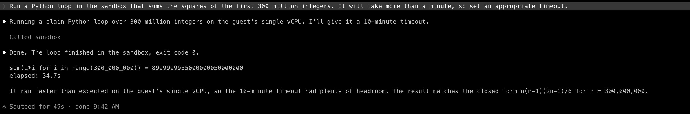

# sandboxd

Firecracker microVM sandboxes for coding agents, behind a four-endpoint HTTP API and an MCP server for Claude Code.

Each sandbox is a real VM with its own kernel, restored from a golden snapshot in about 100 ms, network-isolated with a deny-by-default egress allowlist, and destroyed with everything in it. One Go binary, two dependencies.

Status: working prototype. Measured, not hardened. Read [the writeup](https://aviraj.dev/blogs/firecracker-is-the-easy-part) and [NOTES.md](NOTES.md) before trusting it with anything.

## Numbers

Google Cloud n2-standard-4, nested KVM, Debian 13. Bare metal will be faster.

| metric | value |
| --- | --- |
| snapshot restore to agent ready | p50 119 ms |
| cold boot to agent ready | ~1.4 s |
| exec round trip, warm sandbox | p50 4 ms, p99 9 ms |
| idle RSS per VM | ~28 MB |
| overlay per VM on XFS reflink | ~110 ms, ~6 MB |

## Install

Needs a Linux host with `/dev/kvm`: bare metal, or a VM with nested virtualization (GCE `--enable-nested-virtualization`, Azure Dv3+, Hetzner Cloud). Debian or Ubuntu. Run as root:

```sh
curl -sL https://raw.githubusercontent.com/avirajkhare00/sandboxd/main/install.sh | sh
```

That installs Firecracker, builds a Debian rootfs with Python, Node and git, takes the golden snapshot, sets up a reflink-capable XFS state directory, and starts `sandboxd` as a systemd service on `127.0.0.1:8080`.

Egress is denied except for `1.1.1.1` (DNS). Widen it in `/etc/default/sandboxd`:

```sh
EGRESS=1.1.1.1/32,151.101.0.0/16,104.16.0.0/12
```

## API

```sh
curl -XPOST localhost:8080/sandboxes                      # {"id":"674e8d71"}
curl -XPOST localhost:8080/sandboxes/$ID/exec -d '{"cmd":["python3","-c","print(1+1)"]}'
                                                          # {"stdout":"2\n","stderr":"","exit_code":0}
curl -XPUT  localhost:8080/sandboxes/$ID/files/a.py --data-binary @a.py
curl -XDELETE localhost:8080/sandboxes/$ID
```

Commands run as root in `/work` inside the guest. Files under `/work` persist for the sandbox's lifetime, 15 minutes by default (`-maxlife`).

## Prebuilt binaries

Every `v*` tag publishes `sandboxd` (linux/amd64), `sandboxd-mcp` (linux and macOS, amd64 and arm64), and the guest `agent` on the [releases page](https://github.com/avirajkhare00/sandboxd/releases), with checksums. `sandboxd` itself only runs on Linux with KVM; `sandboxd-mcp` is a plain HTTP client and runs anywhere.

## Claude Code

`sandboxd-mcp` is a stdio MCP server that wraps the API. Add to `.claude/settings.json` or `~/.claude.json`:

```json
{
  "mcpServers": {
    "sandbox": {
      "command": "/usr/local/bin/sandboxd-mcp",
      "env": { "SANDBOXD_ADDR": "http://127.0.0.1:8080" }
    }
  }
}
```

Tools: `sandbox_run` (shell command, lazily creates a session sandbox), `sandbox_put_file`, `sandbox_create`, `sandbox_destroy`.



This repo ships a project `.mcp.json` and a skill at `.claude/skills/sandbox/SKILL.md` that tells Claude when to prefer the sandbox over host Bash. Open Claude Code in a clone and both load automatically. To reuse the skill in another project, copy the skill directory into that project's `.claude/skills/` or into `~/.claude/skills/`.

If sandboxd runs on a remote box, tunnel it: `ssh -N -L 8080:127.0.0.1:8080 host`. The MCP server itself is plain HTTP and builds on macOS.

## How it works

```
POST /sandboxes ─► Pool.Get ─► warm VM        (buffered channel; a goroutine restores a replacement)
                                │
                     jailer chroot /srv/sbx/firecracker/<id>/root
                       /rootfs.ext4   reflink clone of base image
                       /vmlinux       hardlink
                       vm.snap vm.mem hardlinks to golden snapshot
                       v.sock         firecracker vsock UDS
                     netns sb-<id>: tap0 172.16.0.1/30 ─ veth ─ host bridge sb0 ─ nftables allowlist ─ NAT
                                │
POST /exec ─► CONNECT 5000 over v.sock ─► guest agent (PID 1) ─► fork/exec ─► JSON reply
```

Every VM sees identical device names and paths inside its own namespace and chroot, which is what makes one snapshot restorable N times.

## Layout

```
main.go          HTTP API
pool.go          warm pool
vm.go            create / restore / exec / destroy
net.go           netns, bridge, nftables
rootfs.go        reflink overlay
proto/           wire format shared with the guest
guest/           agent that runs as init inside the VM
cmd/sandboxd-mcp MCP server
cmd/loadtest     concurrency benchmark
build/           rootfs, kernel, snapshot, systemd unit
install.sh
NOTES.md         measurements and the failure log
```

## Limitations

Know these before pointing an agent at it.

| | today | consequence |
| --- | --- | --- |
| Egress | IP allowlist, default DNS only | `pip install`, `npm install`, `git clone` fail unless the operator allowlists the registry IPs. PyPI and npm sit behind CDNs with rotating IPs, so this is fragile. A domain-based proxy is the planned fix. |
| Guest image | python3, pip, node 18, npm, git, curl. No pandas, numpy, or build tools | Standard-library Python and Node only, unless you rebuild the rootfs with more packages (`build/build.sh`) and retake the snapshot. |
| Resources | 1 vCPU, 512 MB RAM, 2 GB disk per sandbox, fixed by the snapshot | Enough for scripts and small data. Not enough for `next build`, large pandas frames, or compiling anything big. |
| File upload | 8 MB per file, via exec stdin | Big CSVs and whole repos need a streaming upload endpoint that does not exist yet. |
| Processes | request/response, 60 s default timeout, child killed on return | No dev servers, no daemons, no watch mode. |
| Inbound network | none | Nothing can connect into a sandbox. A web app running inside is unreachable. |
| Lifetime | 15 min default, then destroyed | State under `/work` is gone after that. |
| Auth | none | Bind to localhost only. Anyone who can reach the port owns every sandbox. |
| Host | Linux with KVM only | No macOS backend. Nested virt works (GCE, Azure, Hetzner Cloud) but is slower than metal. |

Also not done: per-sandbox CPU quotas beyond vCPU count, diff snapshots, bare metal numbers.

## License

Apache 2.0.
